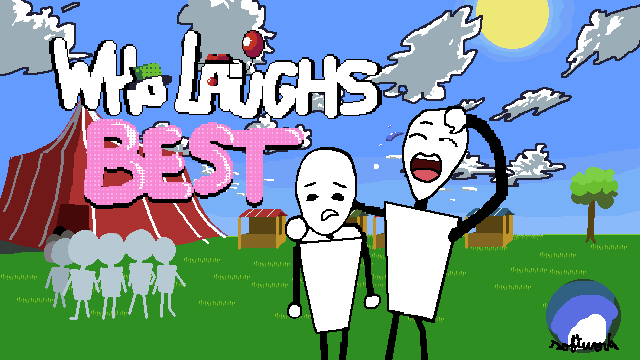

# Who Laughs Best
Um jogo de luta de plataforma 2D (Brawler) com uma mecânica invertida: em vez de tentar nocautear o oponente, o seu objetivo é errar os ataques.

Inspirado em clássicos como Ultimate Chiken Horse, Smash Bros e Brawlhalla, os jogadores assumem o controle de personagens cômicos (como palhaços e mágicos) e utilizam "Desgraças" pela arena. Ganha quem conseguir encher a barra de "Risada" primeiro através de ações desajeitadas e erros calculados.

## 🛠️ Tecnologias Utilizadas

  Engine: Godot Engine 4.7
  
  Linguagem: GDScript

## 🎮 Como Jogar (Controles Padrão)

Os controles podem ser totalmente remapeados no menu de Opções.

  Movimentação: Esquerda, Direita, Baixo.

  Pulo: Pular (permite controle de momento no ar).

  Interação: Botão de uso para coletar e ativar as Desgraças.
